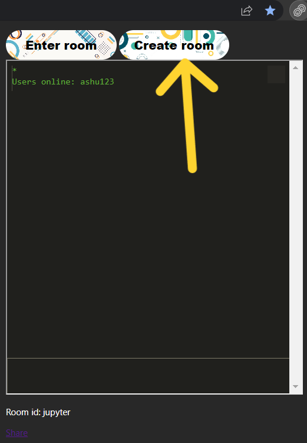
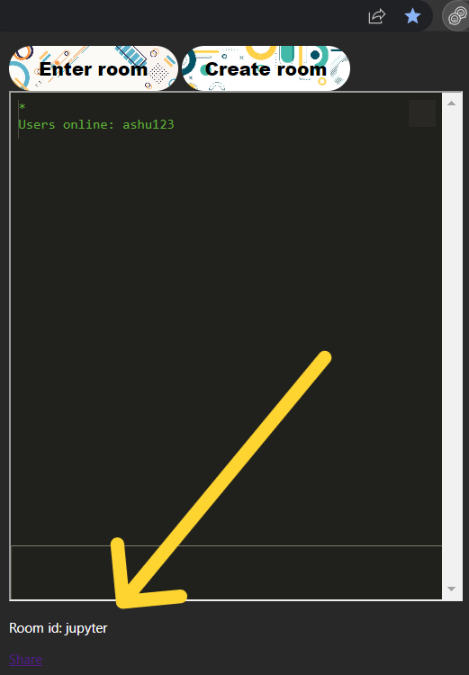
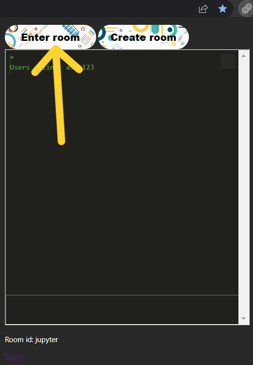

<h1>Chatting Extension for chrome</h1>

I made this extension for fast and distraction free chatting. But i will use it to share link and text between different devices.

 

<h1>How to enable this extexnsion</h1>
<li>open chrome setting > search for more tools > click on extensions </li>
<li>on Extensions page > turn developer mode on </li>
<li>Download the zip </li>
<li>extract it anywhere and rember the path</li>
<li>on Extension page click on load unpacked >locate the path of extract files</li>
<li>Select the folder</li>
<li>pin your extension</li>
<li>you are good to go</li>
 
<h1>How to use </h1>

step1:
  

 
click on this icon on your pinned extension
 
 
 

step2:
  

 
click on create button to create a chat room
 
 
 

step3:
  

 
Here is your room id which can you share
 
 
 

step4:
  

 
click on enetr room and enter the room id to enter in room
 
 
 

<h1>I will make sure to work on this Extension if you find anything missing you can reach me on</h1>

<form action="mailto:mrviral2001+extension@gmail.com" method="post"> 
<input type="text" placeholder="Enter your name"  > 
<input type="email" placeholder="Enter your email"> 
<textarea rows="5" ></textarea> 
<input type="submit" >
</form>

<h3>Guys dont mind i just tried to make a contact form.</h3>

